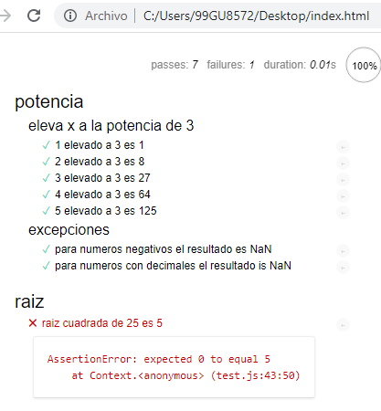
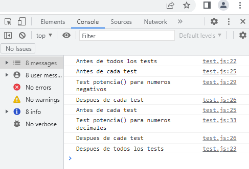
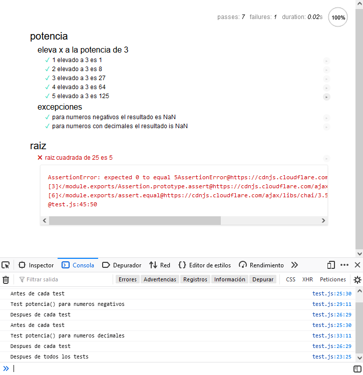

# Frame Mocha para testear BDD

En la metodología BDD (Behavior Driven Development)
primero implementamos el test con una pequeña descripción
que de error y después la funcionalidad que hará que
el test se ponga en verde

Aqui tenemos un ejemplo del framework de Mocha.
Tenemos dos funciones potencia() y raiz() que testeamos

Usamos **Mocha** para el framework de BDD que provee test con descripciones
y **Chai** una librería para hacer assertions https://www.chaijs.com/api/assert/

# Para ejecutar

Descargar de git y abrir index.html
con un navegador como firefox o chrome
y abrir la consola en herraminetas de desarrollo
para ver los console.log

### Resultado de los test en Chrome

### Consola de Chrome con los logs de los tests

### Resultado de los test en Firefox

